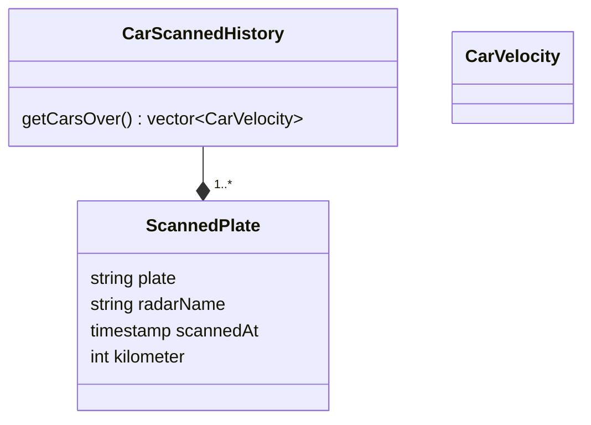

# Problem

https://www.codingame.com/training/easy/1--ngr---basic-radar

The NGR company experiments next generation radars.
They plan to place some plate readers on the road and calculate speed by elapsed time between two points.
For testing, they put two plate readers on the A21. One at km 42 called A21-42 and One at km 55 called A21-55.
The distance between them is 13km.

Find and report all cars over 130km/h with their plate sorted alphabetically.

Timestamp is the number of milliseconds elapsed since January 1, 1970.
All speed value will be truncated to integer. ( 137.89 -> 137 )

# Solution

Criar uma estrutura de Scanner History que é responsável por verificar cada carro e saber quais estão acima de uma velocidade estipulada

